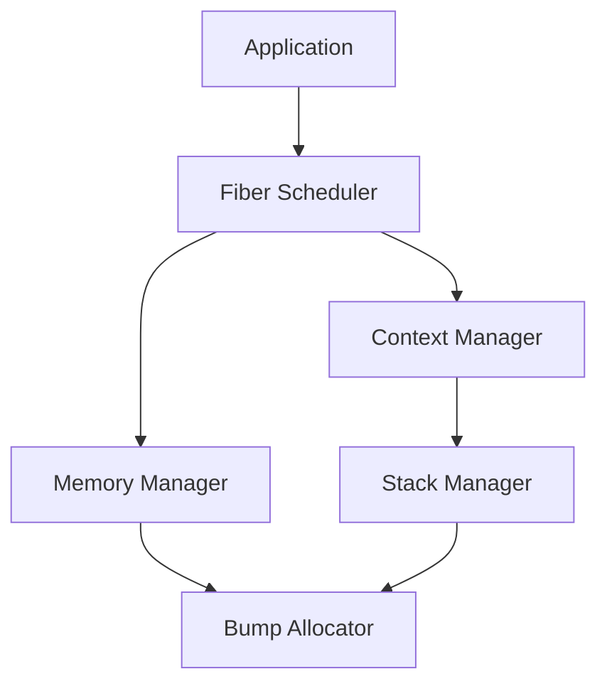

# Examples

This directory contains example implementations demonstrating various aspects of the fiber scheduler and memory management system. Each example is designed to showcase specific features and usage patterns of the library.

## Table of Contents

1. [Overview](#overview)
2. [Prerequisites](#prerequisites)
3. [Building and Running](#building-and-running)
4. [Task Details](#task-details)
   - [Task 1: Basic Fiber Context Management](#task-1-basic-fiber-context-management)
   - [Task 2: Memory Management with Bump Allocator](#task-2-memory-management-with-bump-allocator)
   - [Task 3: Advanced Fiber Scheduling](#task-3-advanced-fiber-scheduling)
5. [Architecture](#architecture)
6. [Performance Considerations](#performance-considerations)
7. [Debugging and Troubleshooting](#debugging-and-troubleshooting)
8. [Best Practices](#best-practices)
9. [Advanced Topics](#advanced-topics)
10. [Contributing](#contributing)
11. [See Also](#see-also)

## Overview

The examples demonstrate three core aspects of the fiber system:
- Context management and fiber lifecycle
- Memory allocation and resource management
- Advanced scheduling and synchronization

Each example builds upon the previous ones, introducing more complex concepts and features.

## Prerequisites

Required tools and dependencies:
- CMake 3.10 or higher
- C++17 compatible compiler
- Platform-specific requirements:
  - x86_64: POSIX-compliant OS, SSE2 support
  - ARM64: NEON support (optional)
  - RISC-V: RV64GC extension

Required libraries:
```cmake
find_package(Threads REQUIRED)  # For thread support
find_package(Boost 1.65 COMPONENTS context fiber REQUIRED)  # For advanced features
```

## Building and Running

### Build System Integration

CMake configuration:
```cmake
# Add examples directory
add_subdirectory(examples)

# Configure individual tasks
add_executable(task1 task1.cpp)
target_link_libraries(task1 PRIVATE fiber_lib allocator_lib)

add_executable(task2 task2.cpp)
target_link_libraries(task2 PRIVATE fiber_lib allocator_lib)

add_executable(task3 task3.cpp)
target_link_libraries(task3 PRIVATE fiber_lib allocator_lib)
```

### Building Examples

```bash
# Configure build
cmake -B build -DCMAKE_BUILD_TYPE=Release

# Build all examples
cmake --build build --target task1 task2 task3

# Build individual examples
cmake --build build --target task1
```

### Running Examples

```bash
# Run with default settings
./task1

# Run with custom stack size
FIBER_STACK_SIZE=65536 ./task1

# Run with debug logging
FIBER_LOG_LEVEL=debug ./task1
```

Environment variables:
- `FIBER_STACK_SIZE`: Custom fiber stack size (default: 64KB)
- `FIBER_LOG_LEVEL`: Logging level (debug, info, warn, error)
- `FIBER_POOL_SIZE`: Initial memory pool size
- `FIBER_GUARD_PAGES`: Enable/disable stack guard pages

## Task Details

### Task 1: Basic Fiber Context Management

Demonstrates fundamental fiber operations and context management.

#### Key Concepts
- Fiber creation and destruction
- Context switching mechanics
- Stack management
- Exception handling
- Resource cleanup

#### Implementation Details

Basic fiber creation:
```cpp
#include "fiber/context.hpp"
#include "fiber/stack.hpp"

class FiberExample {
public:
    FiberExample() {
        // Initialize fiber context
        context_ = std::make_unique<Context>();
        
        // Configure stack
        StackConfig config{
            .size = 64 * 1024,  // 64KB stack
            .guard_pages = true,
            .zero_init = true
        };
        stack_ = std::make_unique<Stack>(config);
    }

    void run() {
        // Create and start fiber
        context_->create_fiber(stack_.get(), [](void* arg) {
            auto self = static_cast<FiberExample*>(arg);
            self->fiber_main();
        }, this);
    }

private:
    void fiber_main() {
        // Fiber execution code
        try {
            // Perform fiber work
            perform_work();
        } catch (const std::exception& e) {
            // Handle exceptions
            handle_error(e);
        }
    }

    std::unique_ptr<Context> context_;
    std::unique_ptr<Stack> stack_;
};
```

#### Advanced Features

1. **Stack Management**
   ```cpp
   // Custom stack allocator
   class StackAllocator {
   public:
       void* allocate(size_t size) {
           // Align to page boundary
           size = (size + 4095) & ~4095;
           
           // Allocate with guard pages
           void* ptr = mmap(nullptr, size + 8192,
                          PROT_READ | PROT_WRITE,
                          MAP_PRIVATE | MAP_ANONYMOUS,
                          -1, 0);
           
           // Configure guard pages
           mprotect(ptr, 4096, PROT_NONE);
           mprotect((char*)ptr + size + 4096, 4096, PROT_NONE);
           
           return (char*)ptr + 4096;
       }
   };
   ```

2. **Context Switching**
   ```cpp
   // Low-level context switch
   struct Context {
       void switch_to(Context* other) {
           // Save current registers
           asm volatile(
               "pushq %%rbp\n"
               "pushq %%rbx\n"
               "pushq %%r12\n"
               "pushq %%r13\n"
               "pushq %%r14\n"
               "pushq %%r15\n"
               "movq %%rsp, (%0)\n"
               // Load new context
               "movq (%1), %%rsp\n"
               "popq %%r15\n"
               "popq %%r14\n"
               "popq %%r13\n"
               "popq %%r12\n"
               "popq %%rbx\n"
               "popq %%rbp\n"
               : : "r"(&this->sp), "r"(&other->sp)
               : "memory"
           );
       }
       void* sp;  // Stack pointer
   };
   ```

### Task 2: Memory Management with Bump Allocator

Demonstrates efficient memory allocation strategies using the bump allocator.

#### Key Concepts
- Bump allocation mechanics
- Memory pool management
- Integration with fiber system
- Resource tracking and cleanup

#### Implementation Details

Basic bump allocator:
```cpp
class BumpAllocator {
public:
    BumpAllocator(size_t size = 1024 * 1024) {
        // Allocate memory pool
        pool_ = std::make_unique<uint8_t[]>(size);
        end_ = pool_.get() + size;
        current_ = pool_.get();
        
        // Initialize metadata
        total_size_ = size;
        allocated_ = 0;
        allocations_ = 0;
    }

    void* allocate(size_t size, size_t alignment = alignof(std::max_align_t)) {
        // Align current pointer
        uint8_t* aligned = align_pointer(current_, alignment);
        if (aligned + size > end_) {
            throw std::bad_alloc();
        }

        // Bump pointer and track allocation
        current_ = aligned + size;
        allocated_ += size;
        allocations_++;

        return aligned;
    }

    void deallocate(void* ptr) {
        // In bump allocator, individual deallocations are no-ops
        // Memory is reclaimed when reset() is called
    }

    void reset() {
        // Reset allocator state
        current_ = pool_.get();
        allocated_ = 0;
        allocations_ = 0;
    }

    // Statistics and monitoring
    struct Stats {
        size_t total_size;
        size_t allocated;
        size_t available;
        size_t allocations;
        double fragmentation;
    };

    Stats get_stats() const {
        return Stats{
            .total_size = total_size_,
            .allocated = allocated_,
            .available = total_size_ - allocated_,
            .allocations = allocations_,
            .fragmentation = 0.0  // Bump allocator has no fragmentation
        };
    }

private:
    uint8_t* align_pointer(uint8_t* ptr, size_t alignment) {
        return reinterpret_cast<uint8_t*>(
            (reinterpret_cast<uintptr_t>(ptr) + alignment - 1)
            & ~(alignment - 1)
        );
    }

    std::unique_ptr<uint8_t[]> pool_;
    uint8_t* current_;
    uint8_t* end_;
    size_t total_size_;
    size_t allocated_;
    size_t allocations_;
};
```

#### Memory Pool Integration

```cpp
// Fiber-aware memory pool
class FiberMemoryPool {
public:
    FiberMemoryPool(size_t initial_size = 1024 * 1024) {
        // Create multiple bump allocators for different sizes
        small_alloc_ = std::make_unique<BumpAllocator>(initial_size / 4);   // For allocations <= 64 bytes
        medium_alloc_ = std::make_unique<BumpAllocator>(initial_size / 2);  // For allocations <= 1024 bytes
        large_alloc_ = std::make_unique<BumpAllocator>(initial_size / 4);   // For larger allocations
    }

    void* allocate(size_t size) {
        // Choose appropriate allocator based on size
        if (size <= 64) {
            return small_alloc_->allocate(size);
        } else if (size <= 1024) {
            return medium_alloc_->allocate(size);
        } else {
            return large_alloc_->allocate(size);
        }
    }

    void reset() {
        // Reset all allocators
        small_alloc_->reset();
        medium_alloc_->reset();
        large_alloc_->reset();
    }

private:
    std::unique_ptr<BumpAllocator> small_alloc_;
    std::unique_ptr<BumpAllocator> medium_alloc_;
    std::unique_ptr<BumpAllocator> large_alloc_;
};
```

### Task 3: Advanced Fiber Scheduling

Demonstrates sophisticated fiber scheduling and synchronization mechanisms.

#### Key Concepts
- Priority-based scheduling
- Work stealing
- Fiber synchronization
- Load balancing

#### Implementation Details

Priority scheduler:
```cpp
class Scheduler {
public:
    enum class Priority {
        LOW,
        NORMAL,
        HIGH,
        REALTIME
    };

    void spawn_fiber(Priority prio, std::function<void()> func) {
        auto fiber = std::make_unique<Fiber>(std::move(func));
        fiber->priority = prio;
        
        // Add to appropriate queue
        queues_[static_cast<int>(prio)].push(std::move(fiber));
        
        // Update scheduler stats
        stats_.total_fibers++;
        stats_.active_fibers++;
    }

    void run() {
        while (has_work()) {
            // Find highest priority fiber
            Fiber* next = nullptr;
            for (int i = static_cast<int>(Priority::REALTIME);
                 i >= static_cast<int>(Priority::LOW); i--) {
                if (!queues_[i].empty()) {
                    next = queues_[i].front().get();
                    queues_[i].pop();
                    break;
                }
            }

            if (next) {
                // Switch to fiber
                current_fiber_ = next;
                next->context.switch_to(&scheduler_context_);
            }
        }
    }

private:
    struct Fiber {
        Context context;
        Priority priority;
        std::function<void()> func;
    };

    Context scheduler_context_;
    Fiber* current_fiber_ = nullptr;
    std::queue<std::unique_ptr<Fiber>> queues_[4];  // One queue per priority

    struct Stats {
        size_t total_fibers = 0;
        size_t active_fibers = 0;
        size_t completed_fibers = 0;
    } stats_;
};
```

#### Work Stealing Implementation

```cpp
class WorkStealingScheduler {
public:
    WorkStealingScheduler(size_t num_threads = std::thread::hardware_concurrency()) {
        // Initialize per-thread queues
        queues_.resize(num_threads);
        
        // Start worker threads
        for (size_t i = 0; i < num_threads; i++) {
            threads_.emplace_back([this, i] { worker_main(i); });
        }
    }

    void worker_main(size_t thread_id) {
        while (!shutdown_) {
            // Try to get work from own queue
            if (auto fiber = queues_[thread_id].try_pop()) {
                execute_fiber(std::move(fiber));
                continue;
            }

            // Try to steal work from other queues
            for (size_t i = 0; i < queues_.size(); i++) {
                if (i == thread_id) continue;
                
                if (auto fiber = queues_[i].try_steal()) {
                    execute_fiber(std::move(fiber));
                    break;
                }
            }
        }
    }

private:
    struct WorkQueue {
        std::deque<std::unique_ptr<Fiber>> fibers;
        std::mutex mutex;

        std::unique_ptr<Fiber> try_pop() {
            std::lock_guard<std::mutex> lock(mutex);
            if (fibers.empty()) return nullptr;
            
            auto fiber = std::move(fibers.front());
            fibers.pop_front();
            return fiber;
        }

        std::unique_ptr<Fiber> try_steal() {
            std::lock_guard<std::mutex> lock(mutex);
            if (fibers.empty()) return nullptr;
            
            auto fiber = std::move(fibers.back());
            fibers.pop_back();
            return fiber;
        }
    };

    std::vector<WorkQueue> queues_;
    std::vector<std::thread> threads_;
    std::atomic<bool> shutdown_{false};
};
```

## Architecture

### Component Interaction



### Memory Layout

```
High Address
+------------------+
| Guard Page       |
+------------------+
| Stack            |
|                  |
| (grows down)     |
|                  |
+------------------+
| Guard Page       |
+------------------+
| Heap             |
| (grows up)       |
|                  |
+------------------+
Low Address
```

## Performance Considerations

### Stack Management
- Use appropriate stack sizes (16KB-64KB typical)
- Enable guard pages in development
- Consider stack pooling for frequent fiber creation/destruction

### Memory Allocation
- Batch allocations where possible
- Use size-specific pools for common allocation sizes
- Reset allocators periodically to prevent fragmentation

### Context Switching
- Minimize unnecessary switches
- Use appropriate priorities
- Consider cache effects of fiber scheduling

### Monitoring and Profiling
```cpp
struct PerformanceMetrics {
    // Timing
    std::chrono::nanoseconds avg_context_switch_time;
    std::chrono::nanoseconds avg_allocation_time;
    
    // Memory
    size_t peak_memory_usage;
    size_t current_memory_usage;
    double fragmentation_ratio;
    
    // Fiber stats
    size_t total_fibers_created;
    size_t active_fibers;
    size_t completed_fibers;
    
    // Scheduler stats
    size_t context_switches;
    size_t work_stealing_attempts;
    size_t successful_steals;
};
```

## Debugging and Troubleshooting

### Common Issues

1. **Stack Overflow**
   - Symptoms: Segmentation fault, corrupted memory
   - Solutions:
     - Increase stack size
     - Enable guard pages
     - Check for recursive calls

2. **Memory Leaks**
   - Symptoms: Growing memory usage
   - Solutions:
     - Reset bump allocators
     - Track allocations
     - Use memory sanitizers

3. **Deadlocks**
   - Symptoms: Hanging fibers
   - Solutions:
     - Check synchronization patterns
     - Use deadlock detection
     - Implement timeouts

### Debugging Tools

```cpp
// Debug logging
class DebugLogger {
public:
    static void log_context_switch(const Context* from, const Context* to) {
        std::cout << "Context switch: " << from << " -> " << to << std::endl;
    }

    static void log_allocation(size_t size, void* ptr) {
        std::cout << "Allocated " << size << " bytes at " << ptr << std::endl;
    }

    static void log_fiber_state(const Fiber* fiber) {
        std::cout << "Fiber " << fiber << " state: " << fiber->state << std::endl;
    }
};
```

## Best Practices

### Resource Management
1. **RAII Principles**
   ```cpp
   class ScopedFiber {
   public:
       ScopedFiber(std::function<void()> func) {
           fiber_ = std::make_unique<Fiber>(std::move(func));
       }
       
       ~ScopedFiber() {
           if (fiber_) {
               fiber_->terminate();
           }
       }
   private:
       std::unique_ptr<Fiber> fiber_;
   };
   ```

2. **Memory Management**
   ```cpp
   class PoolGuard {
   public:
       PoolGuard(BumpAllocator& alloc) : alloc_(alloc) {}
       ~PoolGuard() { alloc_.reset(); }
   private:
       BumpAllocator& alloc_;
   };
   ```

3. **Error Handling**
   ```cpp
   void safe_fiber_execution() {
       try {
           // Fiber work
       } catch (const std::exception& e) {
           log_error(e);
           cleanup_resources();
           throw;
       }
   }
   ```

### Performance Optimization
1. **Cache Alignment**
   ```cpp
   struct alignas(64) CacheAlignedData {
       std::atomic<size_t> counter;
       // Other data...
   };
   ```

2. **Memory Pooling**
   ```cpp
   template<size_t PoolSize>
   class MemoryPool {
       static constexpr size_t chunk_size = 64;
       std::array<uint8_t, PoolSize> pool_;
       // Pool implementation...
   };
   ```

## Advanced Topics

### Custom Allocator Policies
```cpp
template<typename Policy>
class ConfigurableAllocator {
public:
    void* allocate(size_t size) {
        return Policy::allocate(size);
    }

    void deallocate(void* ptr) {
        Policy::deallocate(ptr);
    }
};

// Example policies
struct ThreadSafePolicy {
    static void* allocate(size_t size) {
        std::lock_guard<std::mutex> lock(mutex_);
        // Allocation logic...
    }
    static std::mutex mutex_;
};

struct PoolingPolicy {
    static void* allocate(size_t size) {
        // Pool allocation logic...
    }
};
```

### Fiber Local Storage
```cpp
template<typename T>
class FiberLocal {
public:
    T& get() {
        auto id = current_fiber_id();
        auto it = storage_.find(id);
        if (it == storage_.end()) {
            it = storage_.emplace(id, T{}).first;
        }
        return it->second;
    }

private:
    std::unordered_map<size_t, T> storage_;
};
```

### Synchronization Primitives
```cpp
class FiberMutex {
public:
    void lock() {
        if (!try_lock()) {
            current_fiber()->suspend();
            waiting_fibers_.push(current_fiber());
        }
    }

    void unlock() {
        if (auto next = waiting_fibers_.pop()) {
            next->resume();
        }
        locked_ = false;
    }

private:
    std::atomic<bool> locked_{false};
    FiberQueue waiting_fibers_;
};
```

## Contributing

### Code Style
- Follow existing naming conventions
- Use consistent indentation (4 spaces)
- Document public APIs
- Add unit tests for new features

### Testing
```cpp
// Example test
void test_fiber_creation() {
    FiberExample fiber;
    bool completed = false;
    
    fiber.run([&completed]() {
        // Test work
        completed = true;
    });
    
    assert(completed);
}
```

### Documentation
- Update README.md for new features
- Include code examples
- Document performance implications
- Add troubleshooting notes

## See Also

- [Fiber Implementation Documentation](../fibers/README.md)
- [Allocator Documentation](../allocator/README.md)
- [Main Project README](../README.md)
- [API Reference](../docs/api.md)
- [Performance Guide](../docs/performance.md) 