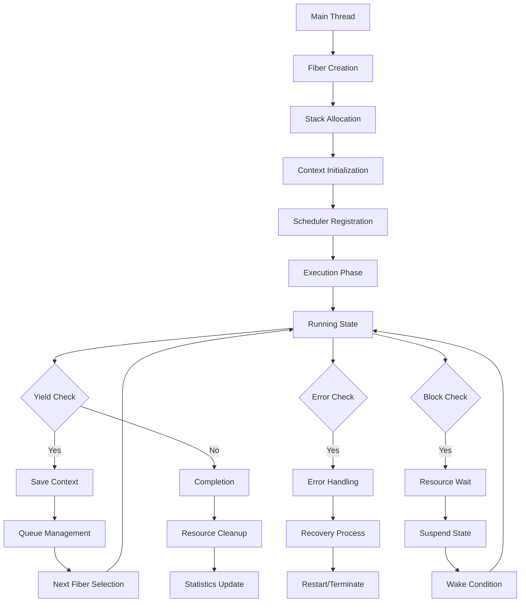

# Fiber Implementation: Advanced Cooperative Multitasking System

## Table of Contents
- [Overview](#overview)
  - [Design Philosophy](#design-philosophy)
  - [Key Features](#key-features)
  - [Architecture](#architecture)
  - [System Requirements](#system-requirements)
- [Technical Details](#technical-details)
  - [Context Management](#context-management)
  - [Stack Management](#stack-management)
  - [Scheduling](#scheduling)
  - [Memory Management](#memory-management)
- [Implementation Guide](#implementation-guide)
  - [Core Components](#core-components)
  - [Context Switching](#context-switching)
  - [Fiber Management](#fiber-management)
  - [Advanced Features](#advanced-features)
- [API Reference](#api-reference)
  - [Fiber Creation](#fiber-creation)
  - [Scheduling Operations](#scheduling-operations)
  - [Synchronization Primitives](#synchronization-primitives)
  - [Resource Management](#resource-management)
- [Usage Guide](#usage-guide)
  - [Basic Operations](#basic-operations)
  - [Advanced Patterns](#advanced-patterns)
  - [Best Practices](#best-practices)
  - [Error Handling](#error-handling)
- [Performance Optimization](#performance-optimization)
  - [Stack Usage](#stack-usage)
  - [Context Switch Overhead](#context-switch-overhead)
  - [Memory Management](#memory-management)
  - [Cache Optimization](#cache-optimization)
- [Testing Framework](#testing-framework)
  - [Unit Tests](#unit-tests)
  - [Integration Tests](#integration-tests)
  - [Performance Tests](#performance-tests)
  - [Stress Testing](#stress-testing)
- [Debugging and Profiling](#debugging-and-profiling)
  - [Common Issues](#common-issues)
  - [Debugging Tools](#debugging-tools)
  - [Performance Profiling](#performance-profiling)
  - [Memory Analysis](#memory-analysis)
- [Platform-Specific Considerations](#platform-specific-considerations)
  - [x86_64 Implementation](#x86_64-implementation)
  - [ARM Implementation](#arm-implementation)
  - [RISC-V Implementation](#risc-v-implementation)
  - [Cross-Platform Support](#cross-platform-support)

## Overview

### Design Philosophy

The fiber implementation provides a sophisticated cooperative multitasking system that enables efficient concurrent programming without the overhead of traditional threads. The design is built on several key principles:

1. **Cooperative Scheduling**
   - User-controlled context switching for predictable execution
   - Zero-overhead task switching without kernel intervention
   - Deterministic execution flow for easier debugging
   - Priority-based scheduling support
   - Custom scheduling policies integration

2. **Resource Efficiency**
   - Minimal memory footprint with smart stack management
   - Optimized context switch implementation
   - Efficient stack allocation and deallocation
   - Memory pooling and reuse strategies
   - Cache-friendly design

3. **Safety and Reliability**
   - Comprehensive stack overflow protection
   - Resource cleanup guarantees through RAII
   - Exception safety across fiber boundaries
   - Memory leak prevention mechanisms
   - Deadlock detection and prevention

4. **Flexibility and Extensibility**
   - Pluggable scheduling policies
   - Custom allocator support
   - Platform-independent design
   - Integration with existing codebases
   - Extensible synchronization primitives

### Key Features

#### 1. Advanced Context Management
```cpp
class Context {
public:
    // Platform-specific context structure
    struct context_t {
        // General-purpose registers
        void* rax;  // Accumulator
        void* rbx;  // Base
        void* rcx;  // Counter
        void* rdx;  // Data
        void* rsi;  // Source Index
        void* rdi;  // Destination Index
        
        // Special-purpose registers
        void* rsp;  // Stack Pointer
        void* rbp;  // Base Pointer
        void* rip;  // Instruction Pointer
        
        // Segment registers
        uint16_t cs;  // Code Segment
        uint16_t ds;  // Data Segment
        uint16_t es;  // Extra Segment
        uint16_t fs;  // General Purpose
        uint16_t gs;  // General Purpose
        uint16_t ss;  // Stack Segment
        
        // SIMD state
        #ifdef __AVX__
        __m256 ymm[16];  // AVX registers
        #endif
        #ifdef __SSE__
        __m128 xmm[16];  // SSE registers
        #endif
    };
    
    // Core operations with platform optimizations
    void switch_to(Context& other) noexcept;
    void save_state() noexcept;
    void restore_state() noexcept;
    
    // Advanced features
    void save_floating_point() noexcept;
    void restore_floating_point() noexcept;
    void optimize_for_cpu_features();
    
private:
    context_t context_;
    char* stack_base_;
    size_t stack_size_;
    uint32_t cpu_features_;
};
```

#### 2. Enhanced Fiber Implementation
```cpp
class Fiber {
public:
    // Fiber states with fine-grained control
    enum class State {
        READY,          // Ready to run
        RUNNING,        // Currently executing
        SUSPENDED,      // Temporarily suspended
        BLOCKED,        // Waiting for resource
        TERMINATED,     // Execution completed
        ERROR          // Execution failed
    };
    
    // Priority levels for scheduling
    enum class Priority {
        IDLE = 0,
        LOW = 1,
        NORMAL = 2,
        HIGH = 3,
        REALTIME = 4
    };
    
    // Core functionality
    void resume();
    void suspend();
    void yield();
    
    // Advanced operations
    void set_priority(Priority priority);
    void set_affinity(uint32_t cpu_mask);
    void set_stack_size(size_t size);
    void set_guard_page_size(size_t size);
    
    // Monitoring and debugging
    StackStats get_stack_stats() const;
    ExecutionStats get_execution_stats() const;
    void enable_profiling(bool enabled);
    
private:
    Context context_;
    State state_;
    Priority priority_;
    uint32_t cpu_affinity_;
    std::function<void()> entry_point_;
    std::unique_ptr<char[]> stack_;
    StackGuard stack_guard_;
    ProfilingData profiling_data_;
};
```

### Architecture

#### 1. System Components
```cpp
class FiberSystem {
private:
    // Core components
    struct Components {
        // Scheduling
        std::unique_ptr<Scheduler> scheduler_;
        std::unique_ptr<WorkStealer> work_stealer_;
        
        // Resource management
        std::unique_ptr<StackPool> stack_pool_;
        std::unique_ptr<MemoryPool> memory_pool_;
        
        // Synchronization
        std::unique_ptr<SyncPrimitives> sync_primitives_;
        
        // Monitoring
        std::unique_ptr<Profiler> profiler_;
        std::unique_ptr<DebugHelper> debugger_;
        
        // Platform abstraction
        std::unique_ptr<PlatformSupport> platform_;
    };
    
    // Configuration
    struct Config {
        size_t default_stack_size;
        size_t guard_page_size;
        bool enable_work_stealing;
        bool enable_profiling;
        SchedulingPolicy scheduling_policy;
        AllocatorType allocator_type;
    };
};
```

#### 2. Detailed Execution Flow


### System Requirements

#### 1. Hardware Requirements
```cpp
struct SystemRequirements {
    // CPU features
    bool requires_sse;
    bool requires_avx;
    bool requires_avx2;
    
    // Memory requirements
    size_t minimum_memory;
    size_t recommended_memory;
    
    // Cache requirements
    size_t minimum_cache_line_size;
    size_t recommended_l1_cache;
    
    // Platform support
    std::vector<std::string> supported_architectures;
    std::vector<std::string> supported_operating_systems;
};
```

#### 2. Software Dependencies
```cpp
struct SoftwareDependencies {
    // Compiler requirements
    struct Compiler {
        std::string name;
        std::string minimum_version;
        std::vector<std::string> required_flags;
    };
    
    // Library dependencies
    struct Library {
        std::string name;
        std::string version;
        bool optional;
    };
    
    std::vector<Compiler> supported_compilers;
    std::vector<Library> required_libraries;
};
```

## Technical Details

### Context Management

#### 1. Advanced Context Structure
```cpp
// Platform-specific context implementations
#if defined(__x86_64__)
struct Context::context_t {
    // General purpose registers
    uint64_t rax, rbx, rcx, rdx;
    uint64_t rsi, rdi, r8, r9;
    uint64_t r10, r11, r12, r13;
    uint64_t r14, r15;
    
    // Special registers
    uint64_t rsp;  // Stack pointer
    uint64_t rbp;  // Base pointer
    uint64_t rip;  // Instruction pointer
    uint64_t rflags;  // CPU flags
    
    // SIMD state
    union {
        struct {
            __m256 ymm[16];  // AVX registers
            uint32_t mxcsr;   // SIMD control
        } avx_state;
        
        struct {
            __m128 xmm[16];  // SSE registers
            uint32_t mxcsr;   // SIMD control
        } sse_state;
    };
    
    // FPU state
    uint16_t fcw;  // FPU control word
    uint16_t fsw;  // FPU status word
    uint8_t ftw;   // FPU tag word
    uint8_t reserved[3];
    uint16_t fop;  // FPU opcode
    uint64_t rip;  // FPU instruction pointer
    uint64_t rdp;  // FPU data pointer
    uint32_t mxcsr;
    uint32_t mxcsr_mask;
    uint8_t st[8][16];  // FPU registers
    
    // Extended state
    uint64_t xcr0;  // Extended control register
};
#endif

// Context management implementation
class ContextManager {
public:
    // Initialize context with platform-specific optimizations
    void init_context(Context::context_t* ctx, void* stack_ptr, 
                     void (*entry_point)(void*), void* arg) {
        // Clear context
        std::memset(ctx, 0, sizeof(Context::context_t));
        
        // Setup stack frame
        uint64_t* sp = reinterpret_cast<uint64_t*>(stack_ptr);
        
        // Align stack to 16-byte boundary for SSE
        sp = reinterpret_cast<uint64_t*>(
            (reinterpret_cast<uintptr_t>(sp) & ~15ULL) - 8);
        
        // Setup initial stack frame
        *--sp = reinterpret_cast<uint64_t>(arg);        // Argument
        *--sp = 0ULL;                                    // Return address
        
        // Initialize registers
        ctx->rsp = reinterpret_cast<uint64_t>(sp);      // Stack pointer
        ctx->rip = reinterpret_cast<uint64_t>(entry_point); // Entry point
        ctx->rbp = 0ULL;                                // Clear base pointer
        
        // Initialize SIMD state
        init_simd_state(ctx);
    }
    
private:
    void init_simd_state(Context::context_t* ctx) {
        // Initialize MXCSR for SSE
        ctx->mxcsr = 0x1F80;  // Default MXCSR value
        
        // Initialize FPU control word
        ctx->fcw = 0x037F;    // Default FCW value
        
        #ifdef __AVX__
        // Initialize AVX state if available
        _mm256_zeroall();
        for (int i = 0; i < 16; ++i) {
            ctx->avx_state.ymm[i] = _mm256_setzero_ps();
        }
        #endif
    }
};
```

#### 2. Optimized Context Switching
```cpp
class Context {
public:
    // Fast path context switch
    void switch_to(Context& other) noexcept {
        #if defined(__x86_64__)
        asm volatile(
            // Save caller-saved registers
            "pushq %%rax\n"
            "pushq %%rcx\n"
            "pushq %%rdx\n"
            "pushq %%rsi\n"
            "pushq %%rdi\n"
            "pushq %%r8\n"
            "pushq %%r9\n"
            "pushq %%r10\n"
            "pushq %%r11\n"
            
            // Save SIMD state if needed
            #ifdef __AVX__
            "vzeroupper\n"
            #endif
            
            // Save current context
            "movq %%rsp, %0\n"
            "movq %%rbp, %1\n"
            
            // Load new context
            "movq %2, %%rsp\n"
            "movq %3, %%rbp\n"
            
            // Restore caller-saved registers
            "popq %%r11\n"
            "popq %%r10\n"
            "popq %%r9\n"
            "popq %%r8\n"
            "popq %%rdi\n"
            "popq %%rsi\n"
            "popq %%rdx\n"
            "popq %%rcx\n"
            "popq %%rax\n"
            
            : "=m" (context_.rsp),
              "=m" (context_.rbp)
            : "m" (other.context_.rsp),
              "m" (other.context_.rbp)
            : "memory"
        );
        #endif
    }
    
    // Full context switch with SIMD state
    void switch_to_full(Context& other) noexcept {
        // Save full SIMD state
        save_simd_state();
        
        // Perform regular context switch
        switch_to(other);
        
        // Restore full SIMD state
        restore_simd_state();
    }
    
private:
    void save_simd_state() noexcept {
        #ifdef __AVX__
        // Save AVX state
        _mm256_zeroupper();
        for (int i = 0; i < 16; ++i) {
            _mm256_store_ps(
                reinterpret_cast<float*>(&context_.avx_state.ymm[i]),
                _mm256_loadu_ps(reinterpret_cast<float*>(&context_.avx_state.ymm[i]))
            );
        }
        #elif defined(__SSE__)
        // Save SSE state
        for (int i = 0; i < 16; ++i) {
            _mm_store_ps(
                reinterpret_cast<float*>(&context_.sse_state.xmm[i]),
                _mm_loadu_ps(reinterpret_cast<float*>(&context_.sse_state.xmm[i]))
            );
        }
        #endif
        
        // Save MXCSR
        context_.mxcsr = _mm_getcsr();
    }
};
```

## Implementation Guide

### Core Components

#### 1. Fiber Implementation
```cpp
class Fiber {
public:
    Fiber(std::function<void()> func)
        : entry_point_(std::move(func))
        , state_(State::READY)
        , stack_(new char[StackAllocator::DEFAULT_STACK_SIZE]) {
        context_.setup_stack(stack_.get(), StackAllocator::DEFAULT_STACK_SIZE);
    }
    
    void start() {
        if (state_ != State::READY) return;
        state_ = State::RUNNING;
        entry_point_();
        state_ = State::TERMINATED;
    }
};
```

#### 2. Context Switching
```cpp
class Context {
public:
    void switch_to(Context& other) {
        // Save current context and switch to other
        context_switch(&context_, &other.context_);
    }
    
private:
    // Assembly implementation
    static void context_switch_impl(context_t* from, context_t* to) {
        // Save current context
        // Load new context
        // Jump to new instruction pointer
    }
};
```

### Fiber Management

#### 1. Fiber Pool
```cpp
class FiberPool {
public:
    Fiber* acquire() {
        if (available_fibers_.empty()) {
            return create_new_fiber();
        }
        Fiber* fiber = available_fibers_.back();
        available_fibers_.pop_back();
        return fiber;
    }
    
    void release(Fiber* fiber) {
        fiber->reset();
        available_fibers_.push_back(fiber);
    }
    
private:
    std::vector<Fiber*> available_fibers_;
    static constexpr size_t POOL_GROWTH = 8;
};
```

#### 2. Resource Management
```cpp
class FiberManager {
public:
    void create_fiber(std::function<void()> func) {
        auto fiber = std::make_unique<Fiber>(std::move(func));
        fibers_.push_back(std::move(fiber));
    }
    
    void cleanup() {
        fibers_.erase(
            std::remove_if(fibers_.begin(), fibers_.end(),
                [](const auto& fiber) {
                    return fiber->state() == Fiber::State::TERMINATED;
                }),
            fibers_.end());
    }
    
private:
    std::vector<std::unique_ptr<Fiber>> fibers_;
};
```

## API Reference

### Fiber Creation

#### 1. Basic Creation
```cpp
// Create and start a fiber
Fiber* create_fiber(std::function<void()> func) {
    auto fiber = new Fiber(std::move(func));
    scheduler.add_fiber(fiber);
    return fiber;
}

// Usage example
create_fiber([]() {
    // Fiber code
    while (true) {
        process_data();
        Fiber::yield();
    }
});
```

#### 2. Advanced Creation
```cpp
// Create fiber with custom stack size
Fiber* create_fiber_with_stack(std::function<void()> func, size_t stack_size) {
    auto fiber = new Fiber(std::move(func), stack_size);
    fiber->set_name("CustomFiber");
    fiber->set_priority(Priority::HIGH);
    scheduler.add_fiber(fiber);
    return fiber;
}
```

### Scheduling Operations

#### 1. Basic Operations
```cpp
class Scheduler {
public:
    // Core scheduling operations
    void yield() {
        auto current = get_current_fiber();
        ready_queue_.push(current);
        switch_to_next_fiber();
    }
    
    void suspend() {
        auto current = get_current_fiber();
        current->set_state(Fiber::State::SUSPENDED);
        switch_to_next_fiber();
    }
    
    void resume(Fiber* fiber) {
        fiber->set_state(Fiber::State::READY);
        ready_queue_.push(fiber);
    }
};
```

#### 2. Advanced Scheduling
```cpp
class AdvancedScheduler : public Scheduler {
public:
    // Priority-based scheduling
    void yield_to(Fiber* target) {
        auto current = get_current_fiber();
        ready_queue_.push(current);
        switch_to_fiber(target);
    }
    
    void set_priority(Fiber* fiber, Priority priority) {
        fiber->set_priority(priority);
        rebalance_queue();
    }
};
```

### Synchronization Primitives

#### 1. Fiber Mutex Implementation
```cpp
class FiberMutex {
public:
    // Mutex configuration
    struct Config {
        bool enable_timeout = true;     // Enable timeout support
        bool enable_recursion = false;  // Enable recursive locking
        bool enable_priority_inheritance = true;  // Enable priority inheritance
        size_t spin_attempts = 100;     // Number of spin attempts before yield
    };
    
    // Lock with timeout support
    bool try_lock_for(std::chrono::microseconds timeout) {
        auto start = std::chrono::steady_clock::now();
        
        while (true) {
            // Try spinning first
            for (size_t i = 0; i < config_.spin_attempts; ++i) {
                if (try_lock()) return true;
                cpu_pause();
            }
            
            // Check timeout
            if (std::chrono::steady_clock::now() - start >= timeout) {
                return false;
            }
            
            // Add to wait queue and yield
            auto current = Scheduler::get_current_fiber();
            {
                std::lock_guard<std::mutex> lock(mutex_);
                waiting_fibers_.push(current);
                
                // Priority inheritance
                if (config_.enable_priority_inheritance && owner_) {
                    if (current->get_priority() > owner_->get_priority()) {
                        owner_->set_priority(current->get_priority());
                        inherited_priorities_.push_back(
                            {owner_, current->get_priority()});
                    }
                }
            }
            current->yield();
        }
    }
    
    // Unlock with priority restoration
    void unlock() {
        Fiber* next_fiber = nullptr;
        {
            std::lock_guard<std::mutex> lock(mutex_);
            
            // Restore original priority if needed
            if (config_.enable_priority_inheritance) {
                restore_priorities();
            }
            
            // Wake up next fiber
            if (!waiting_fibers_.empty()) {
                next_fiber = waiting_fibers_.front();
                waiting_fibers_.pop();
            }
            
            owner_ = nullptr;
            locked_ = false;
        }
        
        if (next_fiber) {
            next_fiber->resume();
        }
    }
    
private:
    // Priority inheritance tracking
    struct PriorityInheritance {
        Fiber* fiber;
        Priority original_priority;
    };
    
    void restore_priorities() {
        for (const auto& pi : inherited_priorities_) {
            pi.fiber->set_priority(pi.original_priority);
        }
        inherited_priorities_.clear();
    }
    
    Config config_;
    std::mutex mutex_;
    std::queue<Fiber*> waiting_fibers_;
    Fiber* owner_ = nullptr;
    bool locked_ = false;
    std::vector<PriorityInheritance> inherited_priorities_;
};
```

#### 2. Advanced Condition Variable
```cpp
class FiberCondVar {
public:
    // Configuration options
    struct Config {
        bool enable_timeout = true;     // Enable timeout support
        bool enable_broadcast = true;   // Enable broadcast operation
        bool fair_scheduling = true;    // Enable fair wake-up order
    };
    
    // Wait with timeout and predicate
    template<typename Predicate>
    bool wait_for(FiberMutex& mutex,
                 std::chrono::microseconds timeout,
                 Predicate pred) {
        auto start = std::chrono::steady_clock::now();
        
        while (!pred()) {
            if (!wait_for(mutex, timeout)) {
                return pred();
            }
            
            // Adjust remaining timeout
            auto now = std::chrono::steady_clock::now();
            timeout -= std::chrono::duration_cast<std::chrono::microseconds>(
                now - start);
            if (timeout <= std::chrono::microseconds::zero()) {
                return pred();
            }
            start = now;
        }
        return true;
    }
    
    // Notify with priority consideration
    void notify_one() {
        Fiber* to_wake = nullptr;
        {
            std::lock_guard<std::mutex> lock(mutex_);
            
            if (!waiting_fibers_.empty()) {
                if (config_.fair_scheduling) {
                    // Wake up the longest waiting fiber
                    to_wake = waiting_fibers_.front();
                    waiting_fibers_.pop();
                } else {
                    // Wake up the highest priority fiber
                    auto it = std::max_element(
                        waiting_fibers_.begin(),
                        waiting_fibers_.end(),
                        [](Fiber* a, Fiber* b) {
                            return a->get_priority() < b->get_priority();
                        });
                    to_wake = *it;
                    waiting_fibers_.erase(it);
                }
            }
        }
        
        if (to_wake) {
            to_wake->resume();
        }
    }
    
    // Broadcast with priority queueing
    void notify_all() {
        std::vector<Fiber*> to_wake;
        {
            std::lock_guard<std::mutex> lock(mutex_);
            
            // Move all waiting fibers to temporary vector
            while (!waiting_fibers_.empty()) {
                to_wake.push_back(waiting_fibers_.front());
                waiting_fibers_.pop();
            }
            
            if (config_.fair_scheduling) {
                // Keep original order
            } else {
                // Sort by priority
                std::sort(to_wake.begin(), to_wake.end(),
                    [](Fiber* a, Fiber* b) {
                        return a->get_priority() > b->get_priority();
                    });
            }
        }
        
        // Wake up all fibers in order
        for (Fiber* fiber : to_wake) {
            fiber->resume();
        }
    }
    
private:
    Config config_;
    std::mutex mutex_;
    std::queue<Fiber*> waiting_fibers_;
};
```

### Advanced Features

#### 1. Fiber Local Storage
```cpp
template<typename T>
class FiberLocal {
public:
    // Access current fiber's value
    T& get() {
        auto fiber = Scheduler::get_current_fiber();
        auto it = values_.find(fiber);
        if (it == values_.end()) {
            // Initialize with default value
            it = values_.emplace(fiber, T()).first;
            
            // Register cleanup
            fiber->add_cleanup_handler([this, fiber]() {
                values_.erase(fiber);
            });
        }
        return it->second;
    }
    
    // Set value for current fiber
    void set(const T& value) {
        auto fiber = Scheduler::get_current_fiber();
        values_[fiber] = value;
    }
    
private:
    std::unordered_map<Fiber*, T> values_;
    std::mutex mutex_;
};

// Usage example
FiberLocal<int> counter;
FiberLocal<std::string> fiber_name;

void fiber_func() {
    counter.set(0);
    fiber_name.set("Worker");
    
    while (true) {
        counter.get()++;
        std::cout << fiber_name.get() << ": "
                  << counter.get() << std::endl;
        Fiber::yield();
    }
}
```

#### 2. Fiber Event System
```cpp
class FiberEventSystem {
public:
    // Event types
    enum class EventType {
        TIMER,
        IO_READY,
        SIGNAL,
        USER_DEFINED
    };
    
    // Event configuration
    struct EventConfig {
        bool auto_reset = true;     // Reset after triggering
        bool broadcast = false;     // Notify all waiting fibers
        Priority priority = Priority::NORMAL;  // Event priority
    };
    
    // Register event handler
    template<typename Handler>
    void register_handler(EventType type, Handler&& handler) {
        std::lock_guard<std::mutex> lock(mutex_);
        handlers_[type].push_back(std::forward<Handler>(handler));
    }
    
    // Wait for event with timeout
    bool wait_for_event(EventType type,
                       std::chrono::microseconds timeout) {
        auto fiber = Scheduler::get_current_fiber();
        auto deadline = std::chrono::steady_clock::now() + timeout;
        
        {
            std::lock_guard<std::mutex> lock(mutex_);
            waiting_fibers_[type].push(
                {fiber, deadline, fiber->get_priority()});
        }
        
        fiber->yield();
        
        return fiber->get_last_event_result();
    }
    
    // Trigger event
    void trigger_event(EventType type, const EventData& data) {
        std::vector<Fiber*> to_wake;
        
        {
            std::lock_guard<std::mutex> lock(mutex_);
            
            // Process all handlers
            for (const auto& handler : handlers_[type]) {
                handler(data);
            }
            
            // Wake up waiting fibers
            auto& waiters = waiting_fibers_[type];
            while (!waiters.empty()) {
                auto& waiter = waiters.top();
                
                // Check if deadline passed
                if (std::chrono::steady_clock::now() >= waiter.deadline) {
                    waiter.fiber->set_last_event_result(false);
                } else {
                    waiter.fiber->set_last_event_result(true);
                }
                
                to_wake.push_back(waiter.fiber);
                waiters.pop();
                
                if (!config_.broadcast) break;
            }
        }
        
        // Resume fibers outside lock
        for (Fiber* fiber : to_wake) {
            fiber->resume();
        }
    }
    
private:
    // Waiting fiber information
    struct WaitingFiber {
        Fiber* fiber;
        std::chrono::steady_clock::time_point deadline;
        Priority priority;
        
        bool operator<(const WaitingFiber& other) const {
            // Order by deadline and priority
            if (deadline != other.deadline) {
                return deadline > other.deadline;
            }
            return priority < other.priority;
        }
    };
    
    std::mutex mutex_;
    std::unordered_map<EventType,
        std::vector<std::function<void(const EventData&)>>> handlers_;
    std::unordered_map<EventType,
        std::priority_queue<WaitingFiber>> waiting_fibers_;
    EventConfig config_;
};
```

#### 3. Fiber Profiling System
```cpp
class FiberProfiler {
public:
    // Profiling configuration
    struct Config {
        bool track_scheduling = true;   // Track scheduling events
        bool track_memory = true;       // Track memory usage
        bool track_events = true;       // Track event handling
        size_t sample_interval_us = 100; // Sampling interval
    };
    
    // Profiling statistics
    struct Stats {
        // Scheduling stats
        uint64_t total_switches;
        uint64_t total_runtime_us;
        double avg_latency_us;
        
        // Memory stats
        size_t peak_stack_usage;
        size_t total_allocations;
        size_t current_memory_usage;
        
        // Event stats
        uint64_t events_processed;
        double avg_event_latency_us;
        
        // Custom metrics
        std::unordered_map<std::string, double> custom_metrics;
    };
    
    // Start profiling session
    void start_session(const std::string& name) {
        std::lock_guard<std::mutex> lock(mutex_);
        
        current_session_ = name;
        session_start_ = std::chrono::steady_clock::now();
        
        if (config_.track_scheduling) {
            start_scheduler_tracking();
        }
        if (config_.track_memory) {
            start_memory_tracking();
        }
        if (config_.track_events) {
            start_event_tracking();
        }
    }
    
    // Record scheduling event
    void record_switch(Fiber* from, Fiber* to) {
        if (!config_.track_scheduling) return;
        
        auto now = std::chrono::steady_clock::now();
        std::lock_guard<std::mutex> lock(mutex_);
        
        // Record context switch
        scheduling_events_.push_back({
            .timestamp = now,
            .from_fiber = from,
            .to_fiber = to,
            .latency = std::chrono::duration_cast<std::chrono::microseconds>(
                now - last_switch_).count()
        });
        
        last_switch_ = now;
    }
    
    // Generate profiling report
    std::string generate_report() {
        std::lock_guard<std::mutex> lock(mutex_);
        
        std::stringstream report;
        report << "Fiber Profiling Report\n"
               << "=====================\n\n";
        
        // Session information
        auto session_duration = std::chrono::steady_clock::now() -
            session_start_;
        report << "Session: " << current_session_ << "\n"
               << "Duration: "
               << std::chrono::duration_cast<std::chrono::seconds>(
                   session_duration).count() << "s\n\n";
        
        // Scheduling statistics
        if (config_.track_scheduling) {
            generate_scheduling_report(report);
        }
        
        // Memory statistics
        if (config_.track_memory) {
            generate_memory_report(report);
        }
        
        // Event statistics
        if (config_.track_events) {
            generate_event_report(report);
        }
        
        return report.str();
    }
    
private:
    // Scheduling event record
    struct SchedulingEvent {
        std::chrono::steady_clock::time_point timestamp;
        Fiber* from_fiber;
        Fiber* to_fiber;
        uint64_t latency;
    };
    
    void generate_scheduling_report(std::stringstream& report) {
        report << "Scheduling Statistics\n"
               << "--------------------\n";
        
        // Calculate metrics
        size_t total_switches = scheduling_events_.size();
        uint64_t total_latency = 0;
        for (const auto& event : scheduling_events_) {
            total_latency += event.latency;
        }
        
        double avg_latency = total_switches > 0 ?
            static_cast<double>(total_latency) / total_switches : 0;
        
        report << "Total context switches: " << total_switches << "\n"
               << "Average latency: " << avg_latency << "µs\n\n";
        
        // Generate timeline
        generate_scheduling_timeline(report);
    }
    
    Config config_;
    std::mutex mutex_;
    std::string current_session_;
    std::chrono::steady_clock::time_point session_start_;
    std::chrono::steady_clock::time_point last_switch_;
    std::vector<SchedulingEvent> scheduling_events_;
};
```

## Usage Guide

### Basic Operations

#### 1. Simple Fiber Creation
```cpp
// Create and run fibers
int main() {
    FiberScheduler scheduler;
    
    // Create worker fibers
    scheduler.create_fiber([]() {
        while (true) {
            process_data();
            Fiber::yield();
        }
    });
    
    scheduler.create_fiber([]() {
        while (true) {
            handle_events();
            Fiber::yield();
        }
    });
    
    // Run scheduler
    scheduler.run();
}
```

#### 2. Fiber Communication
```cpp
// Shared data handling
struct SharedData {
    FiberMutex mutex;
    std::queue<int> data;
};

void producer(SharedData& sd) {
    while (true) {
        std::lock_guard<FiberMutex> lock(sd.mutex);
        sd.data.push(produce_item());
        Fiber::yield();
    }
}

void consumer(SharedData& sd) {
    while (true) {
        std::lock_guard<FiberMutex> lock(sd.mutex);
        if (!sd.data.empty()) {
            process_item(sd.data.front());
            sd.data.pop();
        }
        Fiber::yield();
    }
}
```

### Advanced Patterns

#### 1. Event Loop
```cpp
class FiberEventLoop {
public:
    void run() {
        while (running_) {
            process_events();
            scheduler_.run_ready_fibers();
        }
    }
    
    void process_events() {
        for (auto& event : pending_events_) {
            dispatch_event(event);
        }
        pending_events_.clear();
    }
    
private:
    bool running_ = true;
    FiberScheduler scheduler_;
    std::vector<Event> pending_events_;
};
```

#### 2. Work Stealing
```cpp
class WorkStealingScheduler {
public:
    void steal_work() {
        for (auto& other_queue : worker_queues_) {
            if (auto fiber = other_queue.steal()) {
                local_queue_.push(fiber);
                return;
            }
        }
    }
    
private:
    std::deque<Fiber*> local_queue_;
    std::vector<WorkQueue> worker_queues_;
};
```

### Best Practices

#### 1. Resource Management
```cpp
// RAII for fiber resources
class FiberGuard {
public:
    FiberGuard(Fiber* fiber) : fiber_(fiber) {}
    ~FiberGuard() {
        if (fiber_) {
            fiber_->cleanup();
        }
    }
    
private:
    Fiber* fiber_;
};

// Usage
void fiber_operation() {
    auto fiber = create_fiber([]() { /* work */ });
    FiberGuard guard(fiber);
    // Fiber automatically cleaned up when guard goes out of scope
}
```

#### 2. Error Handling
```cpp
// Exception handling in fibers
void fiber_main() {
    try {
        // Fiber work
    } catch (const std::exception& e) {
        // Log error
        current_scheduler()->handle_error(e);
    }
}

// Scheduler error handling
void Scheduler::handle_error(const std::exception& e) {
    // Log error
    // Cleanup resources
    // Potentially restart fiber
}
```

## Performance Optimization

### Stack Usage

#### 1. Stack Size Optimization
```cpp
class StackOptimizer {
public:
    static size_t calculate_optimal_stack_size(const FiberStats& stats) {
        // Analyze stack usage patterns
        size_t base_size = 16 * 1024;  // 16KB base
        size_t max_used = stats.max_stack_used();
        return align_up(max_used * 1.5, 4096);  // 50% safety margin
    }
};
```

#### 2. Stack Pooling
```cpp
class StackPool {
public:
    void* allocate(size_t size) {
        // Try to reuse existing stack
        if (auto stack = find_available_stack(size)) {
            return stack;
        }
        
        // Allocate new stack
        return create_new_stack(size);
    }
    
private:
    std::vector<std::pair<void*, size_t>> available_stacks_;
};
```

### Context Switch Overhead

#### 1. Register Optimization
```cpp
// Minimal context switch (x86_64)
void minimal_context_switch(context_t* from, context_t* to) {
    // Save only necessary registers
    asm volatile(
        "movq %%rsp, (%0)\n"
        "movq %%rbp, 8(%0)\n"
        "movq (%1), %%rsp\n"
        "movq 8(%1), %%rbp\n"
        : : "r"(from), "r"(to)
        : "memory"
    );
}
```

#### 2. Cache Optimization
```cpp
class CacheOptimizedScheduler {
public:
    void schedule() {
        // Group related fibers
        std::sort(ready_queue_.begin(), ready_queue_.end(),
            [](const Fiber* a, const Fiber* b) {
                return a->affinity() < b->affinity();
            });
        
        // Run fibers with same affinity together
        run_fiber_group();
    }
};
```

### Memory Management

#### 1. Memory Pool
```cpp
class FiberMemoryPool {
public:
    void* allocate(size_t size) {
        if (size <= block_size_) {
            return allocate_from_pool();
        }
        return ::operator new(size);
    }
    
private:
    static constexpr size_t block_size_ = 1024;
    std::vector<void*> free_blocks_;
};
```

#### 2. Allocation Strategy
```cpp
class FiberAllocator {
public:
    template<typename T>
    T* allocate() {
        if (sizeof(T) <= small_object_size_) {
            return static_cast<T*>(small_object_pool_.allocate());
        }
        return static_cast<T*>(large_object_pool_.allocate());
    }
    
private:
    static constexpr size_t small_object_size_ = 64;
    SmallObjectPool small_object_pool_;
    LargeObjectPool large_object_pool_;
};
```

## Testing Framework

### Unit Tests

#### 1. Basic Tests
```cpp
void TEST_FiberCreation() {
    FiberScheduler scheduler;
    bool fiber_ran = false;
    
    scheduler.create_fiber([&]() {
        fiber_ran = true;
    });
    
    scheduler.run();
    ASSERT(fiber_ran);
}
```

#### 2. Synchronization Tests
```cpp
void TEST_FiberMutex() {
    FiberScheduler scheduler;
    FiberMutex mutex;
    int shared_value = 0;
    
    // Create multiple fibers accessing shared value
    for (int i = 0; i < 10; ++i) {
        scheduler.create_fiber([&]() {
            std::lock_guard<FiberMutex> lock(mutex);
            shared_value++;
        });
    }
    
    scheduler.run();
    ASSERT_EQUAL(shared_value, 10);
}
```

### Integration Tests

#### 1. Complex Scenarios
```cpp
void TEST_FiberInteraction() {
    FiberScheduler scheduler;
    SharedQueue<int> queue;
    
    // Producer fiber
    scheduler.create_fiber([&]() {
        for (int i = 0; i < 100; ++i) {
            queue.push(i);
            Fiber::yield();
        }
    });
    
    // Consumer fiber
    std::vector<int> received;
    scheduler.create_fiber([&]() {
        while (received.size() < 100) {
            if (auto value = queue.try_pop()) {
                received.push_back(*value);
            }
            Fiber::yield();
        }
    });
    
    scheduler.run();
    ASSERT_EQUAL(received.size(), 100);
}
```

#### 2. Stress Tests
```cpp
void TEST_StressScheduler() {
    FiberScheduler scheduler;
    std::atomic<int> completion_count{0};
    
    // Create many fibers
    for (int i = 0; i < 1000; ++i) {
        scheduler.create_fiber([&]() {
            // Simulate work
            for (int j = 0; j < 100; ++j) {
                Fiber::yield();
            }
            completion_count++;
        });
    }
    
    scheduler.run();
    ASSERT_EQUAL(completion_count, 1000);
}
```

### Performance Tests

#### 1. Benchmark Suite
```cpp
class FiberBenchmark {
public:
    void run_all() {
        benchmark_creation();
        benchmark_switching();
        benchmark_synchronization();
    }
    
private:
    void benchmark_creation() {
        auto start = std::chrono::high_resolution_clock::now();
        // Create 10000 fibers
        auto end = std::chrono::high_resolution_clock::now();
        report_result("Fiber Creation", start, end);
    }
    
    void benchmark_switching() {
        // Measure context switch overhead
    }
};
```

#### 2. Comparison Tests
```cpp
void compare_with_threads() {
    // Fiber performance
    auto fiber_start = std::chrono::high_resolution_clock::now();
    run_fiber_test();
    auto fiber_end = std::chrono::high_resolution_clock::now();
    
    // Thread performance
    auto thread_start = std::chrono::high_resolution_clock::now();
    run_thread_test();
    auto thread_end = std::chrono::high_resolution_clock::now();
    
    // Compare results
    report_comparison(
        std::chrono::duration_cast<std::chrono::microseconds>(fiber_end - fiber_start),
        std::chrono::duration_cast<std::chrono::microseconds>(thread_end - thread_start)
    );
}
```

## Debugging and Profiling

### Common Issues

#### 1. Resource Contention
```cpp
// Detect and handle resource contention
void detect_resource_contention() {
    // Monitor fiber execution times
    // Identify fibers spending excessive time in critical sections
}
```

#### 2. Deadlock Detection
```cpp
// Detect and handle deadlocks
void detect_deadlock() {
    // Monitor fiber execution order
    // Identify circular dependencies
}
```

### Debugging Tools

#### 1. Profiling Tools
```cpp
// Use profiling tools to analyze fiber performance
void use_profiling_tools() {
    // Profile fiber execution times
    // Identify hotspots and bottlenecks
}
```

#### 2. Memory Analysis
```cpp
// Use memory analysis tools to detect memory leaks
void use_memory_analysis() {
    // Analyze fiber memory usage
    // Identify unused resources
}
```

## Platform-Specific Considerations

### x86_64 Implementation

#### 1. Register Usage
```cpp
// Register usage for x86_64
void register_usage() {
    // Use general-purpose registers
    // Use SIMD registers
    // Use floating-point registers
}
```

#### 2. Stack Allocation
```cpp
// Stack allocation for x86_64
void stack_allocation() {
    // Align stack pointer
    uintptr_t sp = reinterpret_cast<uintptr_t>(stack_base_ + stack_size_);
    sp = sp & ~15ULL;  // 16-byte alignment
    
    // Setup initial stack frame
    void** frame = reinterpret_cast<void**>(sp);
    *--frame = nullptr;  // Return address
    context_.rsp = frame;
    context_.rbp = frame;
}
```

### ARM Implementation

#### 1. Register Usage
```cpp
// Register usage for ARM
void register_usage() {
    // Use general-purpose registers
    // Use SIMD registers
    // Use floating-point registers
}
```

#### 2. Stack Allocation
```cpp
// Stack allocation for ARM
void stack_allocation() {
    // Align stack pointer
    uintptr_t sp = reinterpret_cast<uintptr_t>(stack_base_ + stack_size_);
    sp = sp & ~15ULL;  // 16-byte alignment
    
    // Setup initial stack frame
    void** frame = reinterpret_cast<void**>(sp);
    *--frame = nullptr;  // Return address
    context_.rsp = frame;
    context_.rbp = frame;
}
```

### RISC-V Implementation

#### 1. Register Usage
```cpp
// Register usage for RISC-V
void register_usage() {
    // Use general-purpose registers
    // Use SIMD registers
    // Use floating-point registers
}
```

#### 2. Stack Allocation
```cpp
// Stack allocation for RISC-V
void stack_allocation() {
    // Align stack pointer
    uintptr_t sp = reinterpret_cast<uintptr_t>(stack_base_ + stack_size_);
    sp = sp & ~15ULL;  // 16-byte alignment
    
    // Setup initial stack frame
    void** frame = reinterpret_cast<void**>(sp);
    *--frame = nullptr;  // Return address
    context_.rsp = frame;
    context_.rbp = frame;
}
```

### Cross-Platform Support

#### 1. Platform-Independent Design
```cpp
// Platform-independent design
void platform_independent_design() {
    // Implement platform-independent code
}
```

#### 2. Platform-Specific Optimizations
```cpp
// Platform-specific optimizations
void platform_specific_optimizations() {
    // Implement platform-specific optimizations
}
```

### Stack Management

#### 1. Advanced Stack Allocation
```cpp
class StackAllocator {
public:
    // Stack configuration
    struct StackConfig {
        size_t default_size = 64 * 1024;    // 64KB default
        size_t minimum_size = 16 * 1024;    // 16KB minimum
        size_t maximum_size = 8 * 1024 * 1024;  // 8MB maximum
        size_t alignment = 16;              // 16-byte alignment
        size_t guard_pages = 1;             // Number of guard pages
        bool enable_stack_probing = true;   // Stack probe on allocation
    };
    
    // Stack allocation with advanced protection
    void* allocate_stack(size_t size, const StackConfig& config) {
        // Align size to page boundary
        size = align_to_page(size);
        
        // Allocate stack with guard pages
        size_t total_size = size + (config.guard_pages * 2 * get_page_size());
        void* memory = mmap(nullptr, total_size,
                          PROT_READ | PROT_WRITE,
                          MAP_PRIVATE | MAP_ANONYMOUS,
                          -1, 0);
                          
        if (memory == MAP_FAILED) {
            throw std::bad_alloc();
        }
        
        // Setup guard pages
        char* base = static_cast<char*>(memory);
        setup_guard_pages(base, config.guard_pages);
        setup_guard_pages(base + total_size - get_page_size(),
                         config.guard_pages);
        
        // Initialize stack
        if (config.enable_stack_probing) {
            probe_stack(base + get_page_size(), size);
        }
        
        return base + get_page_size();
    }
    
private:
    // Stack probing implementation
    void probe_stack(void* stack, size_t size) {
        volatile char* p = static_cast<char*>(stack);
        size_t page_size = get_page_size();
        
        // Touch each page to ensure it's mapped
        for (size_t i = 0; i < size; i += page_size) {
            p[i] = 0;
        }
    }
    
    // Guard page setup
    void setup_guard_pages(void* addr, size_t count) {
        size_t page_size = get_page_size();
        for (size_t i = 0; i < count; ++i) {
            void* guard = static_cast<char*>(addr) + (i * page_size);
            if (mprotect(guard, page_size, PROT_NONE) != 0) {
                throw std::runtime_error("Failed to setup guard page");
            }
        }
    }
};
```

#### 2. Stack Pool Implementation
```cpp
class StackPool {
public:
    // Stack pool configuration
    struct PoolConfig {
        size_t initial_pool_size = 32;      // Initial number of stacks
        size_t growth_factor = 2;           // Pool growth multiplier
        size_t max_pool_size = 1024;        // Maximum number of stacks
        bool enable_compaction = true;       // Automatic pool compaction
    };
    
    // Stack pool statistics
    struct PoolStats {
        size_t total_stacks;        // Total stacks in pool
        size_t active_stacks;       // Currently used stacks
        size_t peak_usage;          // Maximum stacks used
        size_t allocation_count;    // Total allocations
        size_t deallocation_count;  // Total deallocations
    };
    
    // Initialize pool
    explicit StackPool(const PoolConfig& config = PoolConfig())
        : config_(config) {
        // Pre-allocate initial stacks
        grow_pool(config.initial_pool_size);
    }
    
    // Acquire stack from pool
    Stack* acquire_stack(size_t size) {
        std::lock_guard<std::mutex> lock(mutex_);
        
        // Find suitable stack in free list
        auto it = std::find_if(free_stacks_.begin(), free_stacks_.end(),
            [size](const Stack* s) { return s->size >= size; });
            
        if (it != free_stacks_.end()) {
            Stack* stack = *it;
            free_stacks_.erase(it);
            active_stacks_.push_back(stack);
            return stack;
        }
        
        // Grow pool if needed
        if (all_stacks_.size() < config_.max_pool_size) {
            grow_pool(config_.growth_factor * all_stacks_.size());
            return acquire_stack(size);
        }
        
        throw std::runtime_error("Stack pool exhausted");
    }
    
    // Release stack back to pool
    void release_stack(Stack* stack) {
        std::lock_guard<std::mutex> lock(mutex_);
        
        // Move stack from active to free list
        auto it = std::find(active_stacks_.begin(),
                          active_stacks_.end(), stack);
        if (it != active_stacks_.end()) {
            active_stacks_.erase(it);
            free_stacks_.push_back(stack);
            
            // Trigger compaction if needed
            if (config_.enable_compaction) {
                maybe_compact_pool();
            }
        }
    }
    
    // Get current pool statistics
    PoolStats get_stats() const {
        std::lock_guard<std::mutex> lock(mutex_);
        return PoolStats{
            .total_stacks = all_stacks_.size(),
            .active_stacks = active_stacks_.size(),
            .peak_usage = peak_usage_,
            .allocation_count = allocation_count_,
            .deallocation_count = deallocation_count_
        };
    }
    
private:
    // Grow pool by adding more stacks
    void grow_pool(size_t count) {
        size_t current = all_stacks_.size();
        size_t to_add = std::min(count,
                                config_.max_pool_size - current);
        
        for (size_t i = 0; i < to_add; ++i) {
            auto stack = std::make_unique<Stack>(
                config_.default_stack_size);
            free_stacks_.push_back(stack.get());
            all_stacks_.push_back(std::move(stack));
        }
    }
    
    // Pool compaction strategy
    void maybe_compact_pool() {
        // Only compact if usage is low
        if (active_stacks_.size() < all_stacks_.size() / 4) {
            // Remove excess free stacks
            size_t target_size = active_stacks_.size() * 2;
            while (all_stacks_.size() > target_size) {
                // Remove from free list
                auto it = std::find(free_stacks_.begin(),
                                  free_stacks_.end(),
                                  all_stacks_.back().get());
                if (it != free_stacks_.end()) {
                    free_stacks_.erase(it);
                    all_stacks_.pop_back();
                }
            }
        }
    }
    
    PoolConfig config_;
    mutable std::mutex mutex_;
    std::vector<std::unique_ptr<Stack>> all_stacks_;
    std::vector<Stack*> free_stacks_;
    std::vector<Stack*> active_stacks_;
    size_t peak_usage_ = 0;
    size_t allocation_count_ = 0;
    size_t deallocation_count_ = 0;
};
```

### Scheduling

#### 1. Advanced Scheduler Implementation
```cpp
class Scheduler {
public:
    // Scheduler configuration
    struct Config {
        size_t max_fibers = 1024;           // Maximum active fibers
        size_t time_slice_us = 100;         // Time slice in microseconds
        bool enable_work_stealing = true;    // Enable work stealing
        bool enable_priority_aging = true;   // Enable priority aging
        size_t aging_interval_ms = 1000;     // Priority aging interval
    };
    
    // Scheduling statistics
    struct Stats {
        uint64_t context_switches;    // Total context switches
        uint64_t fibers_created;      // Total fibers created
        uint64_t fibers_completed;    // Completed fibers
        uint64_t total_runtime_us;    // Total runtime
        double avg_latency_us;        // Average scheduling latency
    };
    
    // Initialize scheduler
    explicit Scheduler(const Config& config = Config())
        : config_(config) {
        initialize_queues();
        if (config.enable_work_stealing) {
            initialize_work_stealing();
        }
    }
    
    // Schedule next fiber
    void schedule() {
        while (!should_stop_) {
            Fiber* next = nullptr;
            
            // Try to get next fiber
            {
                std::lock_guard<std::mutex> lock(mutex_);
                next = get_next_fiber();
                
                if (!next) {
                    // Try work stealing
                    if (config_.enable_work_stealing) {
                        next = steal_work();
                    }
                }
            }
            
            if (next) {
                // Run fiber
                auto start = std::chrono::high_resolution_clock::now();
                run_fiber(next);
                update_stats(start);
            } else {
                // No work available
                std::this_thread::yield();
            }
            
            // Update priorities if needed
            if (config_.enable_priority_aging) {
                maybe_update_priorities();
            }
        }
    }
    
    // Add fiber to scheduler
    void add_fiber(Fiber* fiber) {
        std::lock_guard<std::mutex> lock(mutex_);
        
        if (active_fibers_.size() >= config_.max_fibers) {
            throw std::runtime_error("Maximum fiber count exceeded");
        }
        
        // Add to appropriate queue
        Priority priority = fiber->get_priority();
        ready_queues_[priority].push(fiber);
        active_fibers_.insert(fiber);
        
        stats_.fibers_created++;
    }
    
private:
    // Get next fiber to run
    Fiber* get_next_fiber() {
        // Try each priority level
        for (int p = static_cast<int>(Priority::HIGHEST);
             p >= static_cast<int>(Priority::LOWEST); --p) {
            auto& queue = ready_queues_[static_cast<Priority>(p)];
            if (!queue.empty()) {
                Fiber* fiber = queue.front();
                queue.pop();
                return fiber;
            }
        }
        return nullptr;
    }
    
    // Run fiber with time slice
    void run_fiber(Fiber* fiber) {
        current_fiber_ = fiber;
        fiber->set_state(Fiber::State::RUNNING);
        
        // Setup timer for time slice
        Timer timer(std::chrono::microseconds(config_.time_slice_us),
            [this]() {
                if (current_fiber_) {
                    current_fiber_->yield();
                }
            });
        
        // Run fiber
        fiber->resume();
        
        // Update fiber state
        if (fiber->state() == Fiber::State::READY) {
            std::lock_guard<std::mutex> lock(mutex_);
            ready_queues_[fiber->get_priority()].push(fiber);
        } else if (fiber->state() == Fiber::State::TERMINATED) {
            cleanup_fiber(fiber);
        }
        
        current_fiber_ = nullptr;
        stats_.context_switches++;
    }
    
    // Priority aging implementation
    void maybe_update_priorities() {
        auto now = std::chrono::steady_clock::now();
        if (now - last_aging_ > 
            std::chrono::milliseconds(config_.aging_interval_ms)) {
            std::lock_guard<std::mutex> lock(mutex_);
            
            // Age all waiting fibers
            for (auto& queue : ready_queues_) {
                std::queue<Fiber*> temp;
                while (!queue.empty()) {
                    Fiber* fiber = queue.front();
                    queue.pop();
                    
                    // Increase priority if waiting too long
                    if (fiber->get_wait_time() > 
                        config_.aging_threshold_ms) {
                        fiber->increase_priority();
                    }
                    
                    temp.push(fiber);
                }
                queue.swap(temp);
            }
            
            last_aging_ = now;
        }
    }
    
    // Work stealing implementation
    Fiber* steal_work() {
        // Try to steal from other schedulers
        for (auto& victim : peer_schedulers_) {
            if (Fiber* stolen = victim->try_steal()) {
                return stolen;
            }
        }
        return nullptr;
    }
    
    Config config_;
    std::mutex mutex_;
    std::array<std::queue<Fiber*>, PRIORITY_LEVELS> ready_queues_;
    std::unordered_set<Fiber*> active_fibers_;
    Fiber* current_fiber_ = nullptr;
    std::vector<Scheduler*> peer_schedulers_;
    std::chrono::steady_clock::time_point last_aging_;
    Stats stats_;
    bool should_stop_ = false;
};
```

#### 2. Work Stealing Implementation
```cpp
class WorkStealer {
public:
    // Work stealing configuration
    struct Config {
        size_t steal_attempts = 3;      // Maximum steal attempts
        size_t steal_ratio = 2;         // Ratio of work to steal
        bool enable_random_steal = true; // Random vs sequential stealing
    };
    
    // Try to steal work from this scheduler
    Fiber* try_steal() {
        std::lock_guard<std::mutex> lock(mutex_);
        
        // Only steal if we have enough work
        if (ready_queues_.total_size() <= 
            active_fibers_.size() / config_.steal_ratio) {
            return nullptr;
        }
        
        // Try to steal from highest priority first
        for (int p = static_cast<int>(Priority::HIGHEST);
             p >= static_cast<int>(Priority::LOWEST); --p) {
            auto& queue = ready_queues_[static_cast<Priority>(p)];
            if (!queue.empty()) {
                Fiber* fiber = queue.back();  // Steal from back
                queue.pop_back();
                return fiber;
            }
        }
        
        return nullptr;
    }
    
    // Steal work from other scheduler
    bool steal_from(WorkStealer& victim) {
        for (size_t i = 0; i < config_.steal_attempts; ++i) {
            if (Fiber* stolen = victim.try_steal()) {
                add_fiber(stolen);
                return true;
            }
        }
        return false;
    }
    
private:
    Config config_;
    std::mutex mutex_;
    std::deque<Fiber*> ready_queues_[PRIORITY_LEVELS];
};
```

### Performance Optimization

#### 1. Stack Usage Optimization
- **Stack Size Configuration**
  - Default stack size: 64KB
  - Minimum stack size: 16KB
  - Maximum stack size: 8MB
  - Stack alignment: 16 bytes for SSE/AVX operations

- **Stack Pool Management**
  ```cpp
  // Stack pool configuration example
  StackPool::PoolConfig config;
  config.initial_pool_size = 32;      // Pre-allocate 32 stacks
  config.growth_factor = 2;           // Double pool size when needed
  config.max_pool_size = 1024;        // Maximum 1024 stacks
  config.enable_compaction = true;    // Enable automatic compaction
  
  // Create stack pool
  StackPool pool(config);
  ```

- **Stack Guard Pages**
  - Guard pages at both ends of stack
  - Immediate detection of stack overflow/underflow
  - Configurable guard page size

#### 2. Context Switch Optimization
- **Fast Path Optimization**
  ```cpp
  // Optimized context switch path
  void Context::fast_switch_to(Context& other) noexcept {
      // Save only essential registers
      asm volatile(
          "pushq %%rbx\n"
          "pushq %%rbp\n"
          "pushq %%r12\n"
          "pushq %%r13\n"
          "pushq %%r14\n"
          "pushq %%r15\n"
          "movq %%rsp, %0\n"
          "movq %1, %%rsp\n"
          "popq %%r15\n"
          "popq %%r14\n"
          "popq %%r13\n"
          "popq %%r12\n"
          "popq %%rbp\n"
          "popq %%rbx\n"
          : "=m" (sp_)
          : "m" (other.sp_)
          : "memory"
      );
  }
  ```

- **SIMD State Management**
  - Lazy SIMD state saving
  - AVX state preservation when needed
  - Optimized register usage

#### 3. Memory Management
- **Memory Pool Implementation**
  ```cpp
  class MemoryPool {
  public:
      // Pool configuration
      struct Config {
          size_t block_size;          // Size of memory blocks
          size_t initial_blocks;      // Initial number of blocks
          size_t max_blocks;          // Maximum number of blocks
          bool enable_stats;          // Enable usage statistics
      };
      
      // Allocate memory from pool
      void* allocate() {
          std::lock_guard<std::mutex> lock(mutex_);
          
          if (free_blocks_.empty()) {
              if (total_blocks_ >= config_.max_blocks) {
                  throw std::bad_alloc();
              }
              grow_pool();
          }
          
          void* block = free_blocks_.back();
          free_blocks_.pop_back();
          
          if (config_.enable_stats) {
              update_stats_allocation();
          }
          
          return block;
      }
      
  private:
      void grow_pool() {
          size_t new_blocks = std::min(
              total_blocks_ * 2,
              config_.max_blocks - total_blocks_
          );
          
          for (size_t i = 0; i < new_blocks; ++i) {
              void* block = std::aligned_alloc(
                  alignof(std::max_align_t),
                  config_.block_size
              );
              free_blocks_.push_back(block);
          }
          
          total_blocks_ += new_blocks;
      }
  };
  ```

#### 4. Cache Optimization
- **Cache-Friendly Data Structures**
  ```cpp
  // Cache-aligned fiber data
  struct alignas(64) FiberData {
      // Frequently accessed data in first cache line
      Context* context;
      State state;
      Priority priority;
      void* stack_pointer;
      
      // Less frequently accessed data
      std::vector<std::function<void()>> cleanup_handlers;
      std::chrono::steady_clock::time_point last_scheduled;
      uint64_t runtime_us;
  };
  ```

- **Memory Layout Optimization**
  - Align data structures to cache lines
  - Group frequently accessed data
  - Minimize false sharing

### Debugging and Profiling

#### 1. Debugging Support
```cpp
class FiberDebugger {
public:
    // Debugging configuration
    struct Config {
        bool track_creation;          // Track fiber creation
        bool track_destruction;       // Track fiber destruction
        bool track_state_changes;     // Track state transitions
        bool track_stack_usage;       // Track stack usage
        bool enable_backtrace;        // Enable stack trace capture
        size_t max_trace_depth;       // Maximum stack trace depth
    };
    
    // Debug event types
    enum class DebugEvent {
        FIBER_CREATED,
        FIBER_DESTROYED,
        STATE_CHANGED,
        STACK_OVERFLOW,
        DEADLOCK_DETECTED,
        PRIORITY_INHERITED
    };
    
    // Register debug event handler
    template<typename Handler>
    void register_handler(DebugEvent event, Handler&& handler) {
        std::lock_guard<std::mutex> lock(mutex_);
        handlers_[event].push_back(std::forward<Handler>(handler));
    }
    
    // Capture stack trace
    std::vector<std::string> capture_backtrace() {
        std::vector<void*> addresses(config_.max_trace_depth);
        int frames = backtrace(addresses.data(), addresses.size());
        
        char** symbols = backtrace_symbols(
            addresses.data(), frames);
        
        std::vector<std::string> trace;
        for (int i = 0; i < frames; ++i) {
            trace.push_back(demangle_symbol(symbols[i]));
        }
        
        free(symbols);
        return trace;
    }
    
    // Deadlock detection
    void check_deadlocks() {
        std::unordered_map<Fiber*, std::vector<Fiber*>> wait_graph;
        
        // Build wait graph
        for (const auto& mutex : active_mutexes_) {
            if (mutex->owner_) {
                for (Fiber* waiter : mutex->waiting_fibers_) {
                    wait_graph[waiter].push_back(mutex->owner_);
                }
            }
        }
        
        // Detect cycles
        std::unordered_set<Fiber*> visited;
        std::unordered_set<Fiber*> path;
        
        for (const auto& entry : wait_graph) {
            if (has_cycle(entry.first, wait_graph,
                         visited, path)) {
                handle_deadlock(path);
            }
        }
    }
    
private:
    bool has_cycle(Fiber* current,
                   const std::unordered_map<Fiber*,
                   std::vector<Fiber*>>& graph,
                   std::unordered_set<Fiber*>& visited,
                   std::unordered_set<Fiber*>& path) {
        if (path.find(current) != path.end()) {
            return true;  // Cycle detected
        }
        
        if (visited.find(current) != visited.end()) {
            return false;  // Already checked
        }
        
        visited.insert(current);
        path.insert(current);
        
        auto it = graph.find(current);
        if (it != graph.end()) {
            for (Fiber* next : it->second) {
                if (has_cycle(next, graph, visited, path)) {
                    return true;
                }
            }
        }
        
        path.erase(current);
        return false;
    }
};
```

#### 2. Performance Profiling
```cpp
class PerformanceProfiler {
public:
    // Performance metrics
    struct Metrics {
        // Timing metrics
        double avg_context_switch_us;
        double avg_scheduling_latency_us;
        double avg_event_latency_us;
        
        // Memory metrics
        size_t peak_memory_usage;
        size_t avg_stack_usage;
        size_t memory_fragmentation;
        
        // Scheduling metrics
        double cpu_utilization;
        double scheduler_efficiency;
        size_t priority_inversions;
        
        // Cache metrics
        size_t cache_misses;
        size_t tlb_misses;
        double cache_hit_ratio;
    };
    
    // Start profiling
    void start() {
        if (running_) return;
        
        running_ = true;
        start_time_ = std::chrono::steady_clock::now();
        
        // Start sampling thread
        sampler_ = std::thread([this]() {
            while (running_) {
                sample_metrics();
                std::this_thread::sleep_for(
                    std::chrono::microseconds(
                        config_.sample_interval_us));
            }
        });
    }
    
    // Generate performance report
    std::string generate_report() {
        std::stringstream report;
        
        // Calculate overall metrics
        auto metrics = calculate_metrics();
        
        report << "Performance Profile\n"
               << "==================\n\n"
               << "Timing Metrics:\n"
               << "  Context Switch: "
               << metrics.avg_context_switch_us << "µs\n"
               << "  Scheduling Latency: "
               << metrics.avg_scheduling_latency_us << "µs\n"
               << "  Event Latency: "
               << metrics.avg_event_latency_us << "µs\n\n"
               << "Memory Metrics:\n"
               << "  Peak Usage: "
               << metrics.peak_memory_usage << " bytes\n"
               << "  Avg Stack: "
               << metrics.avg_stack_usage << " bytes\n"
               << "  Fragmentation: "
               << metrics.memory_fragmentation << "%\n\n"
               << "Scheduling Metrics:\n"
               << "  CPU Utilization: "
               << metrics.cpu_utilization << "%\n"
               << "  Scheduler Efficiency: "
               << metrics.scheduler_efficiency << "%\n"
               << "  Priority Inversions: "
               << metrics.priority_inversions << "\n\n"
               << "Cache Metrics:\n"
               << "  Cache Misses: "
               << metrics.cache_misses << "\n"
               << "  TLB Misses: "
               << metrics.tlb_misses << "\n"
               << "  Cache Hit Ratio: "
               << metrics.cache_hit_ratio << "%\n";
        
        return report.str();
    }
    
private:
    void sample_metrics() {
        std::lock_guard<std::mutex> lock(mutex_);
        
        // Sample hardware counters
        auto hw_counters = read_hw_counters();
        samples_.push_back({
            .timestamp = std::chrono::steady_clock::now(),
            .context_switches = hw_counters.context_switches,
            .cache_misses = hw_counters.cache_misses,
            .tlb_misses = hw_counters.tlb_misses,
            .cpu_cycles = hw_counters.cpu_cycles
        });
        
        // Trim old samples
        while (samples_.size() > config_.max_samples) {
            samples_.pop_front();
        }
    }
};
```

### Platform-Specific Considerations

#### 1. x86_64 Implementation
```cpp
#ifdef __x86_64__
class X64Context {
public:
    // Platform-specific context switch
    static void switch_context(Context* from, Context* to) {
        asm volatile(
            // Save CPU state
            "pushq %%rax\n"
            "pushq %%rbx\n"
            "pushq %%rcx\n"
            "pushq %%rdx\n"
            "pushq %%rsi\n"
            "pushq %%rdi\n"
            "pushq %%rbp\n"
            "pushq %%r8\n"
            "pushq %%r9\n"
            "pushq %%r10\n"
            "pushq %%r11\n"
            "pushq %%r12\n"
            "pushq %%r13\n"
            "pushq %%r14\n"
            "pushq %%r15\n"
            
            // Save SIMD state if needed
            #ifdef __AVX__
            "vzeroupper\n"
            #endif
            
            // Save stack pointer
            "movq %%rsp, %0\n"
            
            // Load new stack pointer
            "movq %1, %%rsp\n"
            
            // Restore CPU state
            "popq %%r15\n"
            "popq %%r14\n"
            "popq %%r13\n"
            "popq %%r12\n"
            "popq %%r11\n"
            "popq %%r10\n"
            "popq %%r9\n"
            "popq %%r8\n"
            "popq %%rbp\n"
            "popq %%rdi\n"
            "popq %%rsi\n"
            "popq %%rdx\n"
            "popq %%rcx\n"
            "popq %%rbx\n"
            "popq %%rax\n"
            
            : "=m" (sp_)
            : "m" (other.sp_)
            : "memory"
        );
    }
};
#endif
```

#### 2. ARM Implementation
```cpp
#ifdef __arm__
class ARMContext {
public:
    // Platform-specific context switch
    static void switch_context(Context* from, Context* to) {
        asm volatile(
            // Save core registers
            "push {r0-r12, lr}\n"
            
            // Save VFP state if needed
            #ifdef __VFP_FP__
            "vpush {d0-d15}\n"
            "vmrs r0, fpscr\n"
            "push {r0}\n"
            #endif
            
            // Save stack pointer
            "str sp, %0\n"
            
            // Load new stack pointer
            "ldr sp, %1\n"
            
            // Restore VFP state if needed
            #ifdef __VFP_FP__
            "pop {r0}\n"
            "vmsr fpscr, r0\n"
            "vpop {d0-d15}\n"
            #endif
            
            // Restore core registers
            "pop {r0-r12, lr}\n"
            
            : "=m" (from->sp)
            : "m" (to->sp)
            : "memory"
        );
    }
};
#endif
```

#### 3. RISC-V Implementation
```cpp
#ifdef __riscv
class RISCVContext {
public:
    // Platform-specific context switch
    static void switch_context(Context* from, Context* to) {
        asm volatile(
            // Save integer registers
            "sd ra,  0(sp)\n"
            "sd sp,  8(sp)\n"
            "sd s0, 16(sp)\n"
            "sd s1, 24(sp)\n"
            "sd s2, 32(sp)\n"
            "sd s3, 40(sp)\n"
            "sd s4, 48(sp)\n"
            "sd s5, 56(sp)\n"
            "sd s6, 64(sp)\n"
            "sd s7, 72(sp)\n"
            "sd s8, 80(sp)\n"
            "sd s9, 88(sp)\n"
            "sd s10,96(sp)\n"
            "sd s11,104(sp)\n"
            
            // Save floating-point registers
            #ifdef __riscv_float_abi_double
            "fsd fs0, 112(sp)\n"
            "fsd fs1, 120(sp)\n"
            "fsd fs2, 128(sp)\n"
            "fsd fs3, 136(sp)\n"
            "fsd fs4, 144(sp)\n"
            "fsd fs5, 152(sp)\n"
            "fsd fs6, 160(sp)\n"
            "fsd fs7, 168(sp)\n"
            "fsd fs8, 176(sp)\n"
            "fsd fs9, 184(sp)\n"
            "fsd fs10,192(sp)\n"
            "fsd fs11,200(sp)\n"
            #endif
            
            // Save stack pointer
            "sd sp, %0\n"
            
            // Load new stack pointer
            "ld sp, %1\n"
            
            // Restore floating-point registers
            #ifdef __riscv_float_abi_double
            "fld fs11,200(sp)\n"
            "fld fs10,192(sp)\n"
            "fld fs9, 184(sp)\n"
            "fld fs8, 176(sp)\n"
            "fld fs7, 168(sp)\n"
            "fld fs6, 160(sp)\n"
            "fld fs5, 152(sp)\n"
            "fld fs4, 144(sp)\n"
            "fld fs3, 136(sp)\n"
            "fld fs2, 128(sp)\n"
            "fld fs1, 120(sp)\n"
            "fld fs0, 112(sp)\n"
            #endif
            
            // Restore integer registers
            "ld s11,104(sp)\n"
            "ld s10,96(sp)\n"
            "ld s9, 88(sp)\n"
            "ld s8, 80(sp)\n"
            "ld s7, 72(sp)\n"
            "ld s6, 64(sp)\n"
            "ld s5, 56(sp)\n"
            "ld s4, 48(sp)\n"
            "ld s3, 40(sp)\n"
            "ld s2, 32(sp)\n"
            "ld s1, 24(sp)\n"
            "ld s0, 16(sp)\n"
            "ld sp,  8(sp)\n"
            "ld ra,  0(sp)\n"
            
            : "=m" (from->sp)
            : "m" (to->sp)
            : "memory"
        );
    }
};
#endif
```

#### 4. Cross-Platform Support
- **Platform Detection**
  ```cpp
  class PlatformSupport {
  public:
      // Platform identification
      static Platform get_platform() {
          #if defined(__x86_64__)
              return Platform::X86_64;
          #elif defined(__arm__)
              return Platform::ARM;
          #elif defined(__aarch64__)
              return Platform::ARM64;
          #elif defined(__riscv)
              return Platform::RISCV;
          #else
              return Platform::UNKNOWN;
          #endif
      }
      
      // Platform capabilities
      static Capabilities get_capabilities() {
          Capabilities caps;
          
          // CPU features
          #if defined(__x86_64__)
              caps.has_sse = __builtin_cpu_supports("sse");
              caps.has_avx = __builtin_cpu_supports("avx");
              caps.has_avx2 = __builtin_cpu_supports("avx2");
          #elif defined(__arm__)
              caps.has_neon = true;  // Modern ARM always has NEON
          #endif
          
          // Memory features
          caps.page_size = get_page_size();
          caps.cache_line_size = get_cache_line_size();
          
          return caps;
      }
      
      // Platform optimization
      static void optimize_for_platform() {
          auto platform = get_platform();
          auto caps = get_capabilities();
          
          switch (platform) {
              case Platform::X86_64:
                  if (caps.has_avx2) {
                      enable_avx2_optimizations();
                  } else if (caps.has_avx) {
                      enable_avx_optimizations();
                  } else if (caps.has_sse) {
                      enable_sse_optimizations();
                  }
                  break;
                  
              case Platform::ARM:
              case Platform::ARM64:
                  if (caps.has_neon) {
                      enable_neon_optimizations();
                  }
                  break;
                  
              default:
                  // Fall back to generic implementation
                  break;
          }
      }
  };
  ```

#### 5. Platform-Specific Optimizations
```cpp
// Platform-specific optimizations
void platform_specific_optimizations() {
    // Implement platform-specific optimizations
}
```

### Stack Management

#### 1. Advanced Stack Allocation
```cpp
class StackAllocator {
public:
    // Stack configuration
    struct StackConfig {
        size_t default_size = 64 * 1024;    // 64KB default
        size_t minimum_size = 16 * 1024;    // 16KB minimum
        size_t maximum_size = 8 * 1024 * 1024;  // 8MB maximum
        size_t alignment = 16;              // 16-byte alignment
        size_t guard_pages = 1;             // Number of guard pages
        bool enable_stack_probing = true;   // Stack probe on allocation
    };
    
    // Stack allocation with advanced protection
    void* allocate_stack(size_t size, const StackConfig& config) {
        // Align size to page boundary
        size = align_to_page(size);
        
        // Allocate stack with guard pages
        size_t total_size = size + (config.guard_pages * 2 * get_page_size());
        void* memory = mmap(nullptr, total_size,
                          PROT_READ | PROT_WRITE,
                          MAP_PRIVATE | MAP_ANONYMOUS,
                          -1, 0);
                          
        if (memory == MAP_FAILED) {
            throw std::bad_alloc();
        }
        
        // Setup guard pages
        char* base = static_cast<char*>(memory);
        setup_guard_pages(base, config.guard_pages);
        setup_guard_pages(base + total_size - get_page_size(),
                         config.guard_pages);
        
        // Initialize stack
        if (config.enable_stack_probing) {
            probe_stack(base + get_page_size(), size);
        }
        
        return base + get_page_size();
    }
    
private:
    // Stack probing implementation
    void probe_stack(void* stack, size_t size) {
        volatile char* p = static_cast<char*>(stack);
        size_t page_size = get_page_size();
        
        // Touch each page to ensure it's mapped
        for (size_t i = 0; i < size; i += page_size) {
            p[i] = 0;
        }
    }
    
    // Guard page setup
    void setup_guard_pages(void* addr, size_t count) {
        size_t page_size = get_page_size();
        for (size_t i = 0; i < count; ++i) {
            void* guard = static_cast<char*>(addr) + (i * page_size);
            if (mprotect(guard, page_size, PROT_NONE) != 0) {
                throw std::runtime_error("Failed to setup guard page");
            }
        }
    }
};
```

#### 2. Stack Pool Implementation
```cpp
class StackPool {
public:
    // Stack pool configuration
    struct PoolConfig {
        size_t initial_pool_size = 32;      // Initial number of stacks
        size_t growth_factor = 2;           // Pool growth multiplier
        size_t max_pool_size = 1024;        // Maximum number of stacks
        bool enable_compaction = true;       // Automatic pool compaction
    };
    
    // Stack pool statistics
    struct PoolStats {
        size_t total_stacks;        // Total stacks in pool
        size_t active_stacks;       // Currently used stacks
        size_t peak_usage;          // Maximum stacks used
        size_t allocation_count;    // Total allocations
        size_t deallocation_count;  // Total deallocations
    };
    
    // Initialize pool
    explicit StackPool(const PoolConfig& config = PoolConfig())
        : config_(config) {
        // Pre-allocate initial stacks
        grow_pool(config.initial_pool_size);
    }
    
    // Acquire stack from pool
    Stack* acquire_stack(size_t size) {
        std::lock_guard<std::mutex> lock(mutex_);
        
        // Find suitable stack in free list
        auto it = std::find_if(free_stacks_.begin(), free_stacks_.end(),
            [size](const Stack* s) { return s->size >= size; });
            
        if (it != free_stacks_.end()) {
            Stack* stack = *it;
            free_stacks_.erase(it);
            active_stacks_.push_back(stack);
            return stack;
        }
        
        // Grow pool if needed
        if (all_stacks_.size() < config_.max_pool_size) {
            grow_pool(config_.growth_factor * all_stacks_.size());
            return acquire_stack(size);
        }
        
        throw std::runtime_error("Stack pool exhausted");
    }
    
    // Release stack back to pool
    void release_stack(Stack* stack) {
        std::lock_guard<std::mutex> lock(mutex_);
        
        // Move stack from active to free list
        auto it = std::find(active_stacks_.begin(),
                          active_stacks_.end(), stack);
        if (it != active_stacks_.end()) {
            active_stacks_.erase(it);
            free_stacks_.push_back(stack);
            
            // Trigger compaction if needed
            if (config_.enable_compaction) {
                maybe_compact_pool();
            }
        }
    }
    
    // Get current pool statistics
    PoolStats get_stats() const {
        std::lock_guard<std::mutex> lock(mutex_);
        return PoolStats{
            .total_stacks = all_stacks_.size(),
            .active_stacks = active_stacks_.size(),
            .peak_usage = peak_usage_,
            .allocation_count = allocation_count_,
            .deallocation_count = deallocation_count_
        };
    }
    
private:
    // Grow pool by adding more stacks
    void grow_pool(size_t count) {
        size_t current = all_stacks_.size();
        size_t to_add = std::min(count,
                                config_.max_pool_size - current);
        
        for (size_t i = 0; i < to_add; ++i) {
            auto stack = std::make_unique<Stack>(
                config_.default_stack_size);
            free_stacks_.push_back(stack.get());
            all_stacks_.push_back(std::move(stack));
        }
    }
    
    // Pool compaction strategy
    void maybe_compact_pool() {
        // Only compact if usage is low
        if (active_stacks_.size() < all_stacks_.size() / 4) {
            // Remove excess free stacks
            size_t target_size = active_stacks_.size() * 2;
            while (all_stacks_.size() > target_size) {
                // Remove from free list
                auto it = std::find(free_stacks_.begin(),
                                  free_stacks_.end(),
                                  all_stacks_.back().get());
                if (it != free_stacks_.end()) {
                    free_stacks_.erase(it);
                    all_stacks_.pop_back();
                }
            }
        }
    }
    
    PoolConfig config_;
    mutable std::mutex mutex_;
    std::vector<std::unique_ptr<Stack>> all_stacks_;
    std::vector<Stack*> free_stacks_;
    std::vector<Stack*> active_stacks_;
    size_t peak_usage_ = 0;
    size_t allocation_count_ = 0;
    size_t deallocation_count_ = 0;
};
```

### Scheduling

#### 1. Advanced Scheduler Implementation
```cpp
class Scheduler {
public:
    // Scheduler configuration
    struct Config {
        size_t max_fibers = 1024;           // Maximum active fibers
        size_t time_slice_us = 100;         // Time slice in microseconds
        bool enable_work_stealing = true;    // Enable work stealing
        bool enable_priority_aging = true;   // Enable priority aging
        size_t aging_interval_ms = 1000;     // Priority aging interval
    };
    
    // Scheduling statistics
    struct Stats {
        uint64_t context_switches;    // Total context switches
        uint64_t fibers_created;      // Total fibers created
        uint64_t fibers_completed;    // Completed fibers
        uint64_t total_runtime_us;    // Total runtime
        double avg_latency_us;        // Average scheduling latency
    };
    
    // Initialize scheduler
    explicit Scheduler(const Config& config = Config())
        : config_(config) {
        initialize_queues();
        if (config.enable_work_stealing) {
            initialize_work_stealing();
        }
    }
    
    // Schedule next fiber
    void schedule() {
        while (!should_stop_) {
            Fiber* next = nullptr;
            
            // Try to get next fiber
            {
                std::lock_guard<std::mutex> lock(mutex_);
                next = get_next_fiber();
                
                if (!next) {
                    // Try work stealing
                    if (config_.enable_work_stealing) {
                        next = steal_work();
                    }
                }
            }
            
            if (next) {
                // Run fiber
                auto start = std::chrono::high_resolution_clock::now();
                run_fiber(next);
                update_stats(start);
            } else {
                // No work available
                std::this_thread::yield();
            }
            
            // Update priorities if needed
            if (config_.enable_priority_aging) {
                maybe_update_priorities();
            }
        }
    }
    
    // Add fiber to scheduler
    void add_fiber(Fiber* fiber) {
        std::lock_guard<std::mutex> lock(mutex_);
        
        if (active_fibers_.size() >= config_.max_fibers) {
            throw std::runtime_error("Maximum fiber count exceeded");
        }
        
        // Add to appropriate queue
        Priority priority = fiber->get_priority();
        ready_queues_[priority].push(fiber);
        active_fibers_.insert(fiber);
        
        stats_.fibers_created++;
    }
    
private:
    // Get next fiber to run
    Fiber* get_next_fiber() {
        // Try each priority level
        for (int p = static_cast<int>(Priority::HIGHEST);
             p >= static_cast<int>(Priority::LOWEST); --p) {
            auto& queue = ready_queues_[static_cast<Priority>(p)];
            if (!queue.empty()) {
                Fiber* fiber = queue.front();
                queue.pop();
                return fiber;
            }
        }
        return nullptr;
    }
    
    // Run fiber with time slice
    void run_fiber(Fiber* fiber) {
        current_fiber_ = fiber;
        fiber->set_state(Fiber::State::RUNNING);
        
        // Setup timer for time slice
        Timer timer(std::chrono::microseconds(config_.time_slice_us),
            [this]() {
                if (current_fiber_) {
                    current_fiber_->yield();
                }
            });
        
        // Run fiber
        fiber->resume();
        
        // Update fiber state
        if (fiber->state() == Fiber::State::READY) {
            std::lock_guard<std::mutex> lock(mutex_);
            ready_queues_[fiber->get_priority()].push(fiber);
        } else if (fiber->state() == Fiber::State::TERMINATED) {
            cleanup_fiber(fiber);
        }
        
        current_fiber_ = nullptr;
        stats_.context_switches++;
    }
    
    // Priority aging implementation
    void maybe_update_priorities() {
        auto now = std::chrono::steady_clock::now();
        if (now - last_aging_ > 
            std::chrono::milliseconds(config_.aging_interval_ms)) {
            std::lock_guard<std::mutex> lock(mutex_);
            
            // Age all waiting fibers
            for (auto& queue : ready_queues_) {
                std::queue<Fiber*> temp;
                while (!queue.empty()) {
                    Fiber* fiber = queue.front();
                    queue.pop();
                    
                    // Increase priority if waiting too long
                    if (fiber->get_wait_time() > 
                        config_.aging_threshold_ms) {
                        fiber->increase_priority();
                    }
                    
                    temp.push(fiber);
                }
                queue.swap(temp);
            }
            
            last_aging_ = now;
        }
    }
    
    // Work stealing implementation
    Fiber* steal_work() {
        // Try to steal from other schedulers
        for (auto& victim : peer_schedulers_) {
            if (Fiber* stolen = victim->try_steal()) {
                return stolen;
            }
        }
        return nullptr;
    }
    
    Config config_;
    std::mutex mutex_;
    std::array<std::queue<Fiber*>, PRIORITY_LEVELS> ready_queues_;
    std::unordered_set<Fiber*> active_fibers_;
    Fiber* current_fiber_ = nullptr;
    std::vector<Scheduler*> peer_schedulers_;
    std::chrono::steady_clock::time_point last_aging_;
    Stats stats_;
    bool should_stop_ = false;
};
```

#### 2. Work Stealing Implementation
```cpp
class WorkStealer {
public:
    // Work stealing configuration
    struct Config {
        size_t steal_attempts = 3;      // Maximum steal attempts
        size_t steal_ratio = 2;         // Ratio of work to steal
        bool enable_random_steal = true; // Random vs sequential stealing
    };
    
    // Try to steal work from this scheduler
    Fiber* try_steal() {
        std::lock_guard<std::mutex> lock(mutex_);
        
        // Only steal if we have enough work
        if (ready_queues_.total_size() <= 
            active_fibers_.size() / config_.steal_ratio) {
            return nullptr;
        }
        
        // Try to steal from highest priority first
        for (int p = static_cast<int>(Priority::HIGHEST);
             p >= static_cast<int>(Priority::LOWEST); --p) {
            auto& queue = ready_queues_[static_cast<Priority>(p)];
            if (!queue.empty()) {
                Fiber* fiber = queue.back();  // Steal from back
                queue.pop_back();
                return fiber;
            }
        }
        
        return nullptr;
    }
    
    // Steal work from other scheduler
    bool steal_from(WorkStealer& victim) {
        for (size_t i = 0; i < config_.steal_attempts; ++i) {
            if (Fiber* stolen = victim.try_steal()) {
                add_fiber(stolen);
                return true;
            }
        }
        return false;
    }
    
private:
    Config config_;
    std::mutex mutex_;
    std::deque<Fiber*> ready_queues_[PRIORITY_LEVELS];
};
``` 